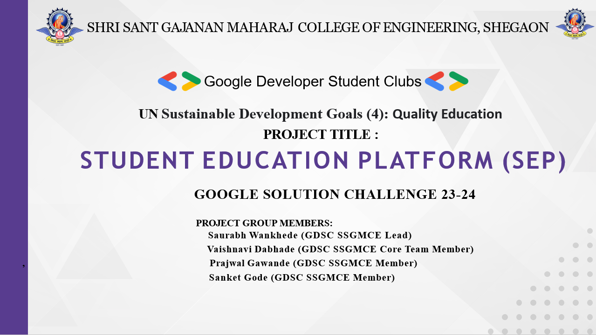
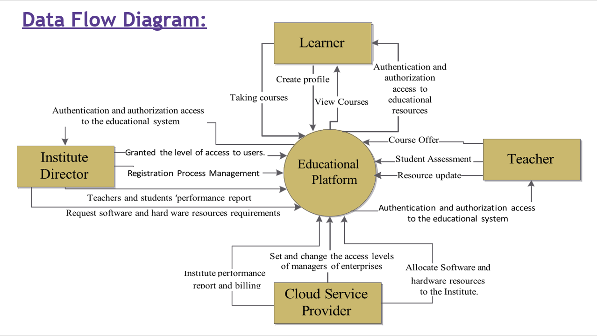
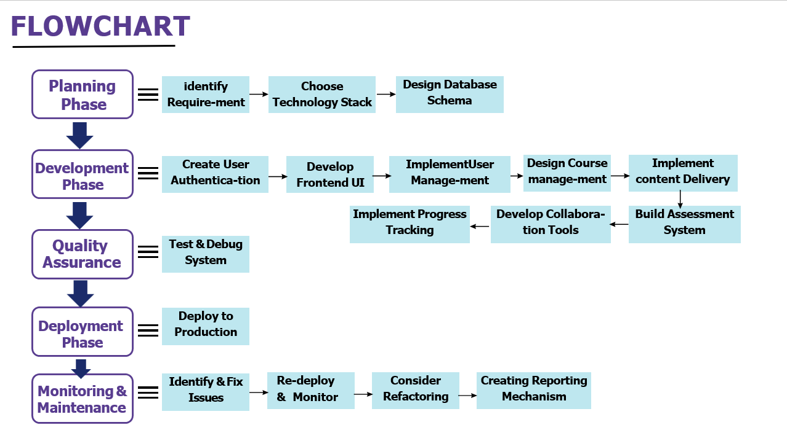

# Student Education Platform (SEP)

## Introduction

SEP is an initiative under the GOOGLE SOLUTION CHALLENGE 23-24, addressing UN Sustainable Development Goal 4: Quality Education. This platform is designed by the team at SSGMC Gemini, and aims to enhance the educational experience for students and educators alike.

## Project Group Members

- Saurabh Wankhede - GDSC SSGMCE Lead
- Vaishnavi Dabhade - GDSC SSGMCE Core Team Member
- Prajwal Gawande - GDSC SSGMCE Member
- Sanket Gode - GDSC SSGMCE Member

## Data Flow Diagram

The data flow diagram illustrates the interactions between different stakeholders (Institute Director, Learner, Teacher, and Cloud Service Provider) within the Educational Platform.

## Flowchart

The flowchart provides a visual representation of the software development lifecycle for the SEP, detailing each phase from planning to monitoring and maintenance.

## Requirements

A detailed list of functional and non-functional requirements such as User Registration & Authentication, User Profile Management, Real-Time Data Updates, Data Privacy, Performance, Scalability, User Experience, and Data Security.

## Project Plan

An outline of the project plan including various phases like Initiation, Research & Planning, Architecture, Development, Deployment, and Maintenance.

## References

Links to the documentation of various technologies and services used in the project:

- [Google Cloud Documentation](https://cloud.google.com/docs)
- [Google AI Developer Documentation](https://ai.google.dev/docs)
- [TensorFlow API Documentation](https://www.tensorflow.org/api_docs)
- [Firebase Documentation](https://firebase.google.com/docs)
- [Vite.js Guide](https://vitejs.dev/guide/)
